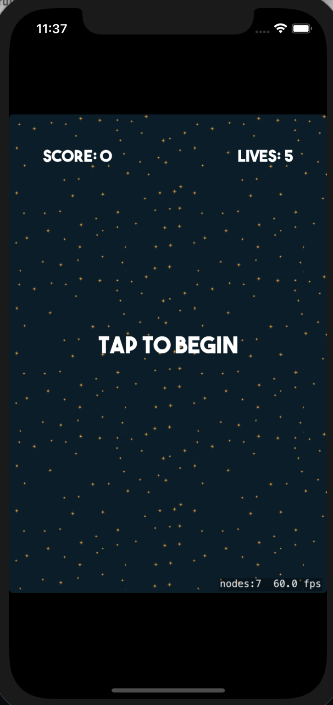
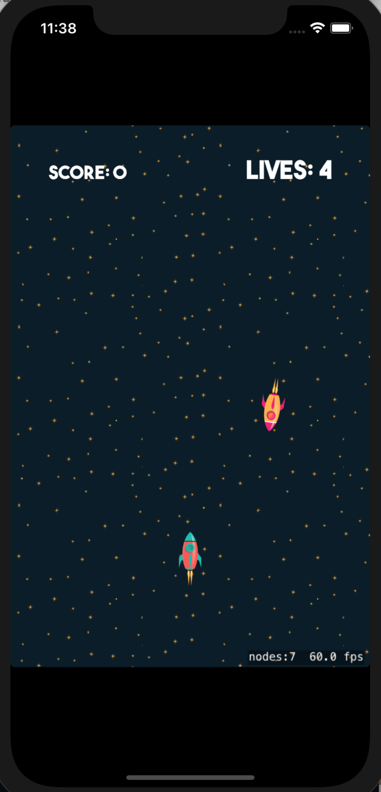
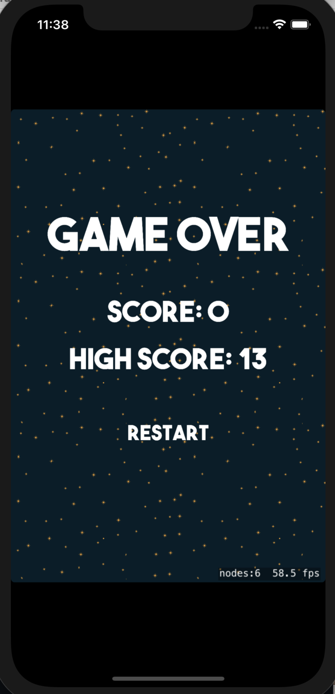

# SoloMission
A game of enemies and bullets. The goal? Kill the enemy with a limited number of lives. 

Photos of how the game looks like/ game scenes: 

_Pregame_

_During the game_

_After the game_

How to play the game: 
1) Download XCode
2) Create a game file by clicking iOS, then Game. Reminder that this game is played using SpriteKit. Name the file "SoloMission", or anything else you'd like
3) Copy and paste the code from repository onto yours
4) Choose the type of phone you want to play on at the top bar
5) Hit run on the top bar
6) Wait for the simulator to set up
7) Once you see the phone, you'll have to keep swiping on the phone via the laptop until you find an app that says "SoloMission", or the file name that you choose. 
8) Once you have found the app, click on it and play!
